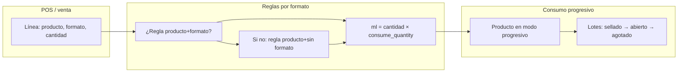

# Consumo progresivo y reglas de consumo por formato

Este documento describe la función de cada pantalla, cómo se complementan y cómo el sistema las aplica al registrar una venta.

## Resumen en una frase

Las **reglas por formato** definen **cuánto** del insumo se descuenta por cada venta según el formato elegido (por ejemplo, ml por trago). El **consumo progresivo** define **cómo** se representa físicamente ese insumo (unidades selladas, capacidad por unidad, apertura y vaciado por lotes).

---

## 1. Consumo progresivo (Inventario)

**Dónde se configura:** pantalla **Inventario**, panel **Consumo progresivo (configuración y lotes)** al seleccionar un producto simple.

### Qué problema resuelve

Sirve para productos que se **compran y almacenan como unidades cerradas** (botellas, bidones) pero se **venden o sirven en porciones** (ml por vaso, trago, etc.). El sistema necesita:

1. Saber **cuánto “cabe” en una unidad nueva** (capacidad y unidad, p. ej. 750 ml).
2. Registrar **cuántas unidades selladas** hay en depósito (lotes **sellados**).
3. Al consumir porciones, **abrir** una unidad sellada si hace falta, **descontar** del remanente de la unidad **abierta** y **marcar como agotada** cuando llega a cero, pasando a la siguiente.

Ese comportamiento está implementado en el repositorio de lotes de producto: se consume una cantidad positiva en ml, abriendo lotes sellados en orden y descontando del lote abierto hasta agotar la cantidad pedida.

### Opciones principales

| Concepto | Significado |
|----------|-------------|
| **Modo: consumo unitario** | El producto se trata como pieza entera en inventario (sin lotes por porciones). Es el comportamiento clásico “una venta = una unidad de stock”. |
| **Modo: consumo progresivo** | El producto tiene **capacidad por unidad** (p. ej. 750) y **unidad** (p. ej. ml). Las entradas de stock en “unidades selladas” crean **lotes** con ese remanente inicial. |
| **Unidades selladas (lotes)** | Altas de inventario en **unidades completas**; cada una genera un lote con `remaining_quantity = capacity` hasta que el consumo lo vaya vaciando. |

Sin modo progresivo y capacidad válida, no se pueden crear lotes sellados para ese producto.

---

## 2. Reglas de consumo por formato (Consumos)

**Dónde se configura:** pantalla **Consumos** — **Consumos por formato**.

### Qué problema resuelve

En el POS, un mismo producto puede venderse con **distintos formatos** (vaso, botella, copa, etc., según lo definido en el catálogo y categorías). Cada combinación **producto + formato de venta** puede implicar un **volumen distinto** servido por línea de venta.

La regla almacena:

- **Producto** base (insumo que tiene el stock).
- **Formato de venta** (opcional): si se deja **sin formato**, la regla aplica como **respaldo** cuando no hay una regla específica para el formato elegido en la línea.
- **Consumo por venta:** cantidad numérica.
- **Unidad:** en la implementación actual, el flujo de venta que alimenta el consumo progresivo **solo admite `ml`** para acumular el descuento sobre lotes.

En tiempo de venta, el sistema busca primero una regla para `(producto, formato de la línea)` y, si no hay ninguna y la línea **sí** tiene formato, **reintenta** con `(producto, sin formato)`.

### Cálculo aplicado en cada línea

Para productos **simples**, si existe regla aplicable:

`ml a consumir en lotes = cantidad de la línea × consume_quantity de la regla`

Ejemplo: regla “250 ml por venta”, cantidad 2 → se consumen **500 ml** en el motor de lotes (una sola acumulación por producto si varias líneas suman al mismo producto).

---

## 3. Relación entre ambas piezas

No son alternativas: **trabajan en capas distintas**.

| Capa | Pregunta que responde |
|------|------------------------|
| **Reglas por formato** | “¿Cuántos **ml** (por línea de venta) debo descontar de este producto cuando se vende con **este formato**?” |
| **Consumo progresivo** | “¿Cómo están **físicamente** esos ml en inventario: en qué **unidades selladas**, cuál está **abierta** y cuánto **queda**?” |

Flujo lógico al cerrar una venta con producto simple:

1. Se determina el **formato de venta** de la línea (según categoría y selección en el POS).
2. Si hay **regla** con unidad `ml`, se calcula el **total de ml** a descontar para ese producto (sumando líneas si aplica).
3. Si ese total es mayor que cero, el sistema llama al consumo **progresivo** sobre los **lotes** del producto, siempre que el producto esté configurado en modo **progresivo** en inventario.

Es decir: la **regla** fija la **tasa** (ml por unidad de venta); el **progresivo** fija el **contenedor** (capacidad por botella) y la **cola** de lotes sellados → abiertos → agotados.

### Qué ocurre si falta una de las dos

- **Progresivo sin regla por formato:** no se calcula cantidad en ml desde el POS para ese producto/formato; no se dispara el descuento por lotes vía reglas (el inventario unitario por movimientos sigue el flujo general de productos simples).
- **Regla sin modo progresivo:** la regla puede existir en base de datos, pero el consumo por **lotes** exige que el producto tenga `consumption_mode = progressive` y capacidad definida; de lo contrario, el repositorio de lotes rechaza el consumo progresivo.

En la práctica operativa, para bebidas por ml conviene **ambas**: reglas que expresen ml por formato y producto en modo progresivo con lotes cargados.

---

## 4. Inventario “global” vs lotes

- El **saldo mostrado** en la vista de inventario proviene de los **movimientos** de inventario por producto (entradas, ajustes, ventas, etc.).
- Las **unidades selladas** al crearse registran además un ingreso de inventario cuyo monto es **capacidad × número de unidades** (misma escala numérica que la capacidad configurada).
- El **detalle físico** del consumo por porciones queda en **lotes** y **movimientos de lote** (incluido el consumo asociado a una venta).

Para interpretar números en productos progresivos, conviene mirar **lotes recientes** y la configuración de capacidad, no solo un único escalar sin contexto.

---

## 5. Referencia técnica (implementación)

| Elemento | Ubicación aproximada |
|----------|----------------------|
| Cálculo de ml por línea y acumulación por producto | `src/main/services/saleService.ts` |
| Aplicación de consumo sobre lotes al persistir la venta | `src/main/repositories/saleRepository.ts` (`createSaleWithItems` → `ProductLotRepository.consumeProgressive`) |
| Lógica de lotes (abrir sellado, descontar, agotar) | `src/main/repositories/productLotRepository.ts` |
| Lectura de reglas por producto y formato | `src/main/repositories/saleFormatConsumptionRepository.ts` |
| Tabla de reglas | `sale_format_product_consumptions` (migración `0022_product_inventory.sql`) |
| Reversión al quitar línea de cargo a cuenta | `SaleRepository.removeTabChargeSaleItem`: modo **unit** ajusta inventario; modo **progressive** devuelve ml al lote abierto si hay regla en ml |

---

## 6. Diagrama de flujo (venta)

---

## 7. Buenas prácticas operativas

1. Definir **formatos de venta** coherentes con el catálogo (categorías y herencia de formatos).
2. Crear **reglas** con **consumo realista** por trago o porción (ml) y, si aplica, reglas **específicas por formato**; usar **sin formato** solo como comodín.
3. Configurar **consumo progresivo** con la **capacidad real** de la unidad de compra (p. ej. botella de 750 ml).
4. Registrar **unidades selladas** al recibir mercadería; revisar **lotes recientes** ante diferencias.

---

*Documento generado para el proyecto system-barra; alineado con el comportamiento del código en la rama de trabajo actual.*
